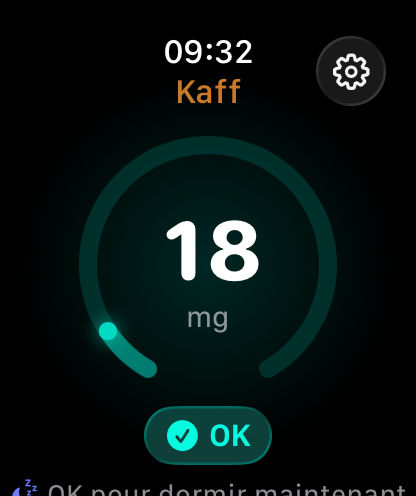
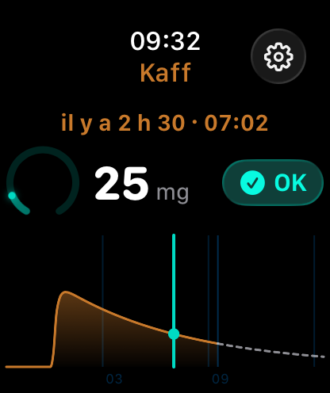
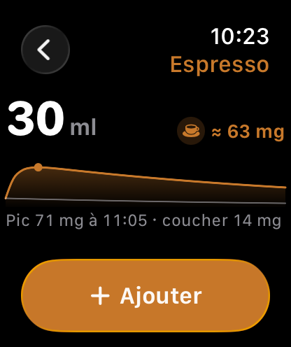
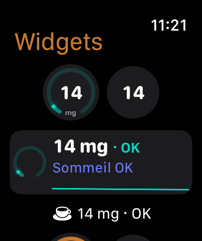

# Kaff

Kaff est une app Apple Watch autonome (watchOS 26, SwiftUI, Swift 6) qui estime en continu la
caféine présente dans l'organisme à partir des boissons enregistrées sur la montre, la compare à
des seuils personnalisés (dose unique selon le poids, cumul du jour, niveau au coucher) et l'expose
en complication sur le cadran. Les doses sont écrites dans Santé (HealthKit), qui reste la source
de vérité ; l'app ne fait que lire, calculer et afficher.

<p align="center">
  
  
  
  
</p>

> Estimation indicative — ce n'est pas un avis médical.

## Fonctionnalités

- **Niveau en direct** : anneau et nombre héros mis à jour chaque minute, courbe 12 h passées + 6 h projetées.
- **Modèle de Bateman** : absorption et élimination de premier ordre, demi-vie réglable (2–10 h).
- **Trois seuils** : pic (Cmax d'une dose unique de 3 mg/kg plafonnée à 200 mg, EFSA 2015), cumul du jour
  (400 mg depuis 04:00), niveau au coucher (35 mg, dérivé de Gardiner 2023) — statut OK / Élevé / Trop haut
  avec la raison, et « OK pour dormir à HH:MM ». Sources et vérification : [`docs/science/`](docs/science/2026-09-04-fact-check.md).
- **Scrubber couronne** : un tap sur la courbe, puis la couronne parcourt le passé et la projection.
- **Aperçu d'impact** : avant d'ajouter une boisson, la courbe « avant / après », le pic et le niveau au coucher.
- **Complication 4 familles** (circulaire, rectangulaire, coin, ligne) avec timeline précalculée qui décroît
  sans ouvrir l'app ; tap → écran Boisson (`kaff://log`).
- **HealthKit source de vérité** : doses `dietaryCaffeine` lues et écrites dans Santé, poids `bodyMass` lu
  pour les seuils ; le widget ne touche jamais HealthKit, il lit un instantané dans l'App Group.

## Comment ça marche

Modèle à un compartiment : pour une dose `D` (mg) prise à `t = 0`, la quantité dans l'organisme vaut

```
A(t) = D · ka / (ka − ke) · (e^(−ke·t) − e^(−ka·t))      t en heures
ke   = ln 2 / t½      t½ = 5 h par défaut (réglable 2–10 h)
ka   = 5,0 h⁻¹        pic ≈ 44 min après la prise, à ≈ 90 % de D
```

Les doses se superposent (PK linéaire) : `A_total(t) = Σ A_i(t − t_i)`. Les seuils et le statut sont
décrits dans la spec, [§4 Modèle pharmacocinétique](docs/superpowers/specs/2026-08-27-kaff-design.md#4-modèle-pharmacocinétique)
et [§5 Évaluation du niveau](docs/superpowers/specs/2026-08-27-kaff-design.md#5-évaluation-du-niveau-levelassessor).

## Prérequis

- Xcode 26.6 et le SDK watchOS 26 (simulateurs Apple Watch Series 11 en watchOS 26.5).
- [XcodeGen](https://github.com/yonaskolb/XcodeGen) (`brew install xcodegen`) — le `.xcodeproj` est généré, jamais édité à la main.
- Un compte développeur Apple pour installer sur une montre physique (le simulateur n'en a pas besoin).

## Installation

```bash
cp Config/Local.xcconfig.example Config/Local.xcconfig   # puis renseigner DEVELOPMENT_TEAM (Team ID)
make run                                                 # génère le projet, build, installe et lance sur le simulateur
make test                                                # tests de l'app sur le simulateur
```

| Cible | Effet |
|---|---|
| `make generate` | `xcodegen generate` (crée `Config/Local.xcconfig` depuis l'exemple si absent) |
| `make build` | Build Debug de l'app Watch pour le simulateur |
| `make run` | Build + installation + lancement sur le simulateur |
| `make test` | Tests de l'app (`KaffTests`) sur le simulateur, avec couverture |
| `make test-core` | `swift test` du package `KaffCore` |
| `make clean` | Supprime `build/`, le `.xcodeproj` et `.build` du package |

Variables : `SIM` (défaut `Apple Watch Series 11 (46mm)`), `OS` (défaut `26.5`), ou `SIM_ID` pour un UDID précis.
Pour la montre physique : `xcodegen generate && open Kaff.xcodeproj`, choisir la montre comme destination, Run.

## Architecture

- **`Packages/KaffCore`** — logique pure et testée : modèles, catalogue de boissons, modèle PK,
  `LevelAssessor` (seuils), `TimelineBuilder` (courbe), `WidgetTimelinePlanner` (entrées de complication).
- **`KaffUI/`** — jetons de thème, `KaffRingView`, libellés de statut, formats ; sources compilées à la fois
  dans l'app et dans l'extension (pas de framework).
- **`Kaff Watch App/`** — SwiftUI : écrans (`Features/`), `AppModel` `@Observable`, services HealthKit,
  cache App Group et profil (`Services/`).
- **`KaffComplication/`** — extension WidgetKit : quatre familles accessory, timeline précalculée avec
  croisements de seuils, deep link `kaff://log`.

```
Kaff/
├── project.yml              # XcodeGen (cibles app, extension, tests)
├── Makefile                 # generate / build / run / test / test-core
├── Config/                  # Local.xcconfig (Team ID, ignoré par git) + exemple
├── Packages/KaffCore/       # package SwiftPM, tests Swift Testing
├── KaffUI/                  # thème, anneau, formats (partagés)
├── Kaff Watch App/          # App, Features, Services, Shared, Resources
├── KaffComplication/        # extension WidgetKit
├── KaffTests/               # tests de l'app (AppModel, mocks des stores)
└── docs/                    # roadmap, plan, spec, direction UI, captures
```

## Suivi

- [Roadmap et journal](docs/ROADMAP.md) — état des jalons M0→M5, décisions, blocages.
- [Plan d'implémentation](docs/superpowers/plans/2026-08-27-kaff-implementation.md) — tâches détaillées.
- [Spécification](docs/superpowers/specs/2026-08-27-kaff-design.md) — modèle, seuils, écrans, complication.
- [Direction UI/UX](docs/design/ui-direction.md) — brief de design watchOS 26.
- [Instructions de travail](CLAUDE.md).

## Limites connues

- Les doses ajoutées depuis l'iPhone (ou une autre app) sont prises en compte à la prochaine ouverture de l'app.
- Pas de notifications (« dernière dose avant le coucher », « niveau redescendu ») en v1.
- Le niveau est une estimation indicative issue d'un modèle générique — ce n'est pas un avis médical.
- Aucun capteur de la montre ne mesure la caféine : tout repose sur les prises saisies. Le contenu réel d'une
  tasse varie du simple au sextuple selon l'établissement (espresso 48–322 mg) ; au-delà de ~500 mg en une prise
  la cinétique n'est plus linéaire et le résidu est sous-estimé ; grossesse et certains médicaments (fluvoxamine)
  sortent des bornes de demi-vie. Usage adulte uniquement.

## Licence

À définir.
