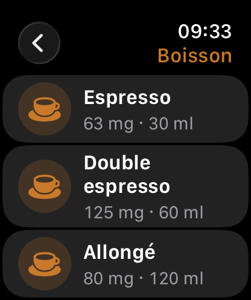
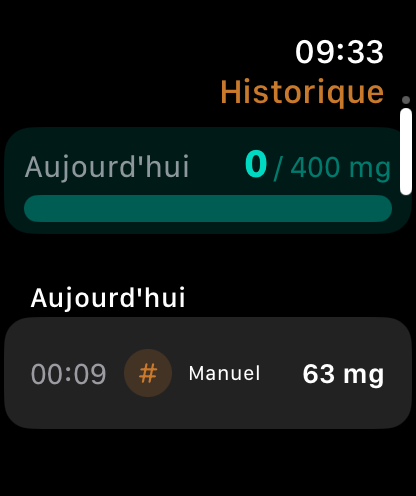
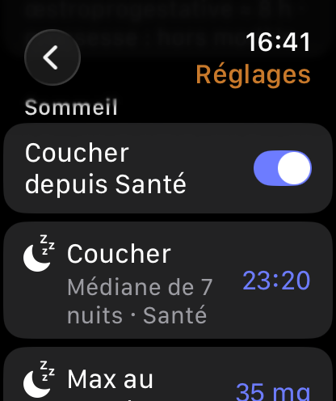
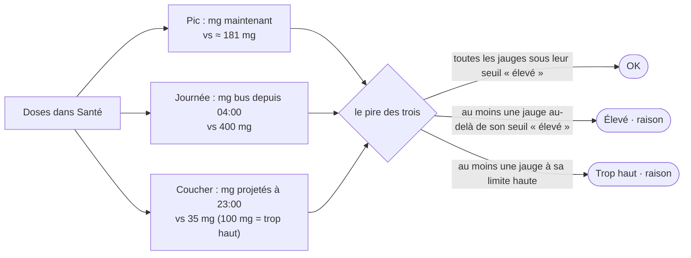
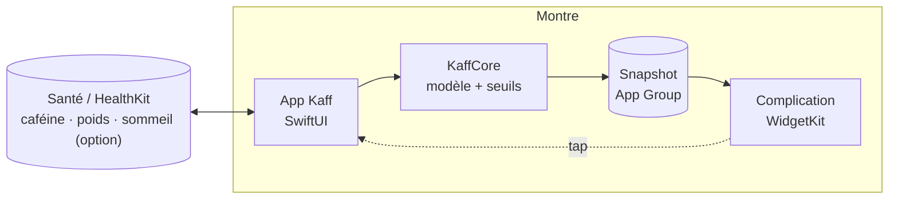

<div align="center">


# Kaff

**Combien de caféine il te reste dans le corps, là, maintenant.**

Une app Apple Watch autonome qui suit ce que tu bois, estime en continu la caféine présente dans ton organisme,
te dit si c'est OK, élevé ou trop haut, à quelle heure tu pourras dormir tranquille, et l'affiche sur le cadran.


<br>

&nbsp;
&nbsp;
&nbsp;
&nbsp;


<sub>Simulateur Apple Watch Series 11, 46 mm.</sub>

</div>

> **Estimation indicative, pas un avis médical.** Aucun capteur ne mesure la caféine : Kaff calcule à partir de
> ce que tu déclares avoir bu. Usage adulte.

---

## Sommaire

1. [En trente secondes](#en-trente-secondes)
2. [Ce que fait Kaff](#ce-que-fait-kaff)
3. [Comment ça marche](#comment-ça-marche)
4. [La science derrière](#la-science-derrière)
5. [Confidentialité](#confidentialité)
6. [Sous le capot](#sous-le-capot)
7. [Développement](#développement)
8. [Versions et suivi](#versions-et-suivi)
9. [Limites connues](#limites-connues)
10. [Licence](#licence)

---

## En trente secondes

| | |
|---|---|
| ☕ **Tu enregistres** | Une boisson du catalogue (espresso, thé, cola…) ou une quantité en mg, en deux taps et un tour de couronne. La dose part dans Santé, qui reste la source de vérité. |
| 📉 **Kaff calcule chaque minute** | Ce qu'il en reste dans ton organisme, avec le modèle pharmacocinétique standard de la caféine et une demi-vie que tu peux régler. |
| 🚦 **Trois questions décident du statut** | Le niveau du moment, le total de la journée, et ce qu'il restera au coucher. Le pire des trois donne la couleur, la raison est affichée. |
| ⌚ **Le cadran suit tout seul** | La complication reçoit d'avance toute la courbe et décroît sans ouvrir l'app. |

---

## Ce que fait Kaff

### Accueil

Un grand nombre, un anneau coloré, une pastille de statut. Le nombre décroît en direct. Tourne la couronne
pour remonter 12 h en arrière ou te projeter 6 h en avant sur la courbe ; tape la pastille pour voir les trois
jauges et la raison du statut. « OK pour dormir à 23:26 » te dit quand le niveau sera repassé sous le seuil.

### Enregistrer une boisson

Un carrousel de boissons, tes favorites en tête. Choisis, ajuste le volume à la couronne : les mg se
recalculent et un aperçu montre l'impact sur la courbe et le pic à venir. Tu peux aussi saisir des mg
directement, avec l'équivalence en espressos. Chaque dose est écrite dans Santé (type « caféine alimentaire »)
et peut être supprimée d'un glissement dans l'historique.

### Coucher depuis Santé

Aucun capteur ne mesure la caféine, mais la montre sait quand tu te couches. En option, Kaff lit tes nuits des
14 derniers jours, en lecture seule et sans jamais les afficher, et prend la médiane de tes heures de coucher,
siestes exclues, à partir de trois nuits. Cette heure sert à la question « coucher » et à la complication ;
sinon c'est celle que tu règles à la main.

<div align="center">

</div>

### Deux notifications, chacune en option

- **« OK pour dormir »** quand le niveau repasse sous le seuil coucher, jamais après 04:00.
- **« Dernière prise avant le coucher »**, calculée pour ta boisson favorite : le dernier instant où la prendre
  laisse encore le niveau sous le seuil à l'heure du coucher. Un espresso de 63 mg, avec un seuil de 35 mg et
  une demi-vie de 5 h, c'est environ 4 h 30 avant.

### Réglages

Poids (lu dans Santé, ou saisi), demi-vie avec des repères sourcés (tabac, contraception, grossesse), heure de
coucher manuelle ou déduite, seuils journée et coucher, boissons personnalisées. Tout se règle à la couronne.

### Complication

Quatre familles (circulaire, rectangulaire, coin, ligne), un grain de café fondu derrière l'anneau, et une
timeline précalculée : le cadran se met à jour sans ouvrir l'app. Un tap ouvre l'accueil.

---

## Comment ça marche

### 1 · Une dose suit toujours la même courbe

Une fois bue, la caféine passe dans le sang en une quarantaine de minutes, puis l'organisme l'élimine de moitié
toutes les cinq heures environ. Kaff modélise ça avec la courbe de Bateman (un compartiment, absorption et
élimination de premier ordre), le modèle standard de la littérature pour la caféine.

<div align="center">

</div>

<details>
<summary>La formule</summary>

Pour une dose `D` prise à `t = 0` :

```
A(t) = D · ka / (ka − ke) · (e^(−ke·t) − e^(−ka·t))

ka = 5 h⁻¹          absorption (pic ≈ 44 min après la prise)
ke = ln 2 / t½      élimination
t½ = 5 h            par défaut, réglable de 2 à 10 h
```

</details>

### 2 · Les boissons s'additionnent

Chaque prise a sa propre courbe ; ce que tu as dans le corps, c'est la somme. Kaff relit toutes les doses de
Santé et les superpose. Voici une journée : deux espressos le matin, un thé noir à 16:30.

<div align="center">

</div>

Le bandeau du haut est ce que la montre affiche. Dès le thé de 16:30, le statut passe à « élevé · coucher » :
non pas parce que le niveau est haut maintenant, mais parce qu'il en restera 37 mg à 23:00, au-dessus des 35 mg
retenus. Kaff indique alors l'heure à partir de laquelle le niveau sera passé sous ce seuil, 23:26 : à cet instant
le statut coucher redevient OK, les deux messages disent la même chose. Le thé une heure plus tôt, et tout restait OK.

### 3 · Trois questions, chaque minute

<div align="center">

</div>

| Question | Ce qui est comparé | Limite par défaut | « Élevé » dès |
|---|---|---|---|
| **Pic** · est-ce beaucoup, là maintenant ? | mg dans l'organisme | ce qu'atteint une dose unique de 3 mg/kg, plafond 200 mg, soit ≈ 181 mg | 60 % |
| **Journée** · ai-je trop bu aujourd'hui ? | mg ingérés depuis 04:00 | 400 mg | 75 % |
| **Coucher** · vais-je bien dormir ? | mg qu'il restera à l'heure du coucher | 35 mg, « trop haut » dès 100 mg | dès la limite |



### 4 · Ta demi-vie change tout

Cinq heures est une moyenne. Un fumeur ou un gros buveur de café élimine plus vite, une contraception orale
ralentit l'élimination, et la génétique fait le reste. C'est le réglage le plus important de l'app.

<div align="center">

</div>

### 5 · La complication sait déjà tout

Puisque la courbe est déterministe, Kaff calcule d'avance la timeline de la complication : une entrée tous les
quarts d'heure, plus une entrée exactement à chaque changement de statut. Si l'app n'a pas été ouverte depuis
plus longtemps que la fenêtre de doses transmise (30 h au moins), la complication affiche « Ouvrir Kaff » :
elle ne peut plus garantir qu'aucune dose ne lui manque.

<div align="center">

</div>

<details>
<summary>Et en mg/L ? Une idée mise de côté</summary>

Une concentration plasmatique estimée (`C = A / (0,67 L/kg × poids)`, ≈ 3,9 mg/L pour 180 mg à 70 kg) a été
étudiée et sourcée ([docs/science](docs/science/2026-09-04-fact-check.md) §7). Ce seraient les mêmes seuils vus
autrement, l'anneau ne changerait pas. Elle n'est pas affichée : la montrer sur le cadran obligerait à transmettre
un volume dérivé du poids à la complication, et Kaff préfère ne rien stocker de tel dans l'espace partagé. Les
calculs restent dans `KaffCore`, prêts si l'idée revient.

</details>

---

## La science derrière

Chaque constante de Kaff a été confrontée à la littérature : avis EFSA 2015, IOM 2001, méta-analyse Gardiner
2023, articles originaux, base USDA, avec extraits cités et DOI. Résultat : l'approche est la bonne, deux valeurs
ont été corrigées et quelques attributions rectifiées.

| Ce que dit la littérature | Ce que fait Kaff |
|---|---|
| Rien, sur une montre, ne mesure la caféine : FC, VFC, température ou SpO2 ne sont pas des marqueurs exploitables | Un journal des prises et un modèle, pas de capteur |
| Le modèle à un compartiment de Bateman est le meilleur ajustement en pharmacocinétique de population | Le même modèle, ka = 5 h⁻¹, demi-vie 5 h réglable |
| L'EFSA fixe 200 mg par prise et 400 mg par jour pour un adulte | Les mêmes limites ; la limite de pic est la charge maximale qu'atteint une dose de 200 mg |
| Gardiner 2023 : un café 8,8 h avant le coucher, un pré-workout 13,2 h avant, pour ne pas perdre de sommeil | Ces deux scénarios projetés donnent 32,5 et 35,9 mg au coucher, d'où le seuil de 35 mg |

<div align="center">

</div>

→ **[docs/science/](docs/science/README.md)** : la synthèse, les deux revues complètes, les décisions et le backlog sourcé.

---

## Confidentialité



- **Tout reste sur la montre.** Pas de réseau, pas de serveur, pas de statistiques, pas de publicité.
- **Santé est la source de vérité.** Les doses et le poids y vivent, sauvegardés avec ton iPhone et
  réutilisables par n'importe quelle autre app. Supprimer une dose dans Kaff la supprime de Santé.
- **La complication ne touche jamais Santé.** Elle lit un instantané léger : doses récentes et seuils déjà
  calculés, jamais le poids ni les nuits.
- **Le sommeil est en option**, lu uniquement pour déduire l'heure de coucher, jamais affiché ni stocké.

→ [Politique de confidentialité](docs/PRIVACY.md)

---

## Sous le capot

```
Kaff/
├── Packages/KaffCore/       logique pure et testée : modèle PK, seuils, timeline, catalogue, notifications
├── KaffUI/                  thème, anneau, grain de café, formats — compilés dans l'app et dans l'extension
├── Kaff Watch App/          SwiftUI : écrans, AppModel @Observable, services HealthKit, cache, notifications
├── KaffComplication/        extension WidgetKit, quatre familles accessory, deep link kaff://home
├── KaffTests/               tests de l'app avec stores simulés
├── docs/                    science, figures, roadmap, spec, direction UI, captures
├── project.yml              XcodeGen — le .xcodeproj n'est jamais édité à la main
└── Makefile
```

| Choix | Pourquoi |
|---|---|
| Toute la logique dans un package Swift pur, `KaffCore` | Testée sous macOS en quelques secondes, 130 tests, couverture ≈ 99 % ; les vues restent fines |
| HealthKit comme stockage | Données dans Santé, sauvegardées, réutilisables ; aucune base propre à l'app |
| Timeline WidgetKit précalculée | La décroissance est déterministe : le cadran vit sans l'app |
| Swift 6 strict concurrency, Swift Testing, Swift Charts, Liquid Glass | Outillage à jour, couronne digitale et haptiques partout où ça a du sens |
| XcodeGen | Projet reproductible, pas de conflits sur le `.xcodeproj` |

---

## Développement

> Section de travail de l'auteur. Compiler ou exécuter Kaff à partir de ce dépôt demande son autorisation
> écrite (voir [Licence](#licence)) ; pour tester l'app, passe par TestFlight sur invitation.

<details>
<summary>Prérequis et commandes</summary>

Xcode 26.6 avec le SDK watchOS 26, [XcodeGen](https://github.com/yonaskolb/XcodeGen) (`brew install xcodegen`),
un compte développeur Apple pour une montre physique.

```bash
cp Config/Local.xcconfig.example Config/Local.xcconfig   # puis renseigner DEVELOPMENT_TEAM (Team ID)
make run                                                 # génère le projet, build, installe et lance sur le simulateur
```

| Cible | Effet |
|---|---|
| `make generate` | `xcodegen generate` (crée `Config/Local.xcconfig` depuis l'exemple si absent) |
| `make build` / `make run` | Build Debug, puis installation et lancement sur le simulateur |
| `make test` | Tests de l'app sur le simulateur, avec couverture |
| `make test-core` | `swift test` du package `KaffCore` |
| `make figures` | Regénère les figures de ce README (matplotlib) |
| `make archive` / `make testflight` | Archive App Store puis envoi TestFlight (conteneur iOS pour une app watch-only) |
| `make clean` | Supprime `build/`, le `.xcodeproj` et `.build` du package |

Variables : `SIM` (défaut `Apple Watch Series 11 (46mm)`), `OS` (défaut `26.5`), ou `SIM_ID` pour un UDID précis.

Outils de debug sur simulateur, via `SIMCTL_CHILD_…` au lancement : `KAFF_WIDGET_GALLERY=1` (galerie des
complications), `KAFF_SEED_SLEEP=1` (sème sept nuits dans Santé), `KAFF_DYNAMIC_TYPE=AX5` (taille de texte).

</details>

---

## Versions et suivi

| Version | Contenu | État |
|---|---|---|
| **v0.1** | Journal, modèle, trois seuils, complication, fact-check scientifique | Validée sur Apple Watch Ultra 2, tag `v0.1.0` |
| **v0.2** | Coucher déduit du sommeil Santé, deux notifications, indicateur de fraîcheur, repères de demi-vie | Sur TestFlight, validation montre en cours |
| **v0.3** | Grain de café derrière les jauges ; concentration mg/L étudiée puis mise de côté | Sur TestFlight, validation montre en cours |

- [Roadmap et journal](docs/ROADMAP.md) : jalons, décisions, blocages, au jour le jour.
- [Plan d'implémentation](docs/superpowers/plans/2026-08-27-kaff-implementation.md) et
  [spécification](docs/superpowers/specs/2026-08-27-kaff-design.md).
- [Direction UI/UX](docs/design/ui-direction.md), [instructions de travail](CLAUDE.md).

---

## Limites connues

- Les doses ajoutées depuis l'iPhone ou une autre app sont prises en compte à la prochaine ouverture de Kaff.
- Les notifications sont replanifiées à chaque ouverture de l'app : sans l'ouvrir de la journée, le plan de la
  veille n'est pas recalculé.
- Le sommeil lu sur la montre est celui qu'elle a suivi elle-même, ou synchronisé récemment : un sommeil saisi
  seulement sur l'iPhone ou par une app tierce peut manquer.
- Le contenu réel d'une tasse varie du simple au sextuple selon le café ; au-delà de ~500 mg en une prise le
  modèle sous-estime le résidu ; grossesse et certains médicaments sortent des bornes de demi-vie.
  Détail dans [docs/science](docs/science/README.md#ce-que-kaff-ne-sait-pas-faire-et-le-dit).

---

## Licence

Copyright © 2026 Nicolas Bataille. **Tous droits réservés.** Ce dépôt est publié à titre de consultation
uniquement ([LICENSE.md](LICENSE.md)). Sans autorisation écrite de l'auteur, il est interdit de copier,
reproduire, compiler, exécuter, modifier, redistribuer ou réutiliser le code, les documents et les ressources de
ce dépôt, à quelque fin que ce soit. Lire le code et le citer brièvement avec attribution reste permis ; l'app se
teste par TestFlight sur invitation.

<div align="center">
<sub>Kaff est un projet personnel. Estimation indicative, pas un avis médical.</sub>
</div>
