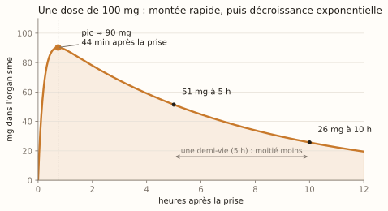
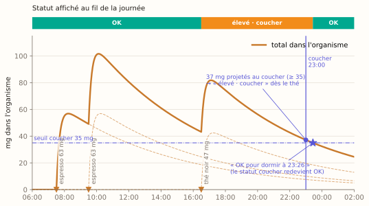
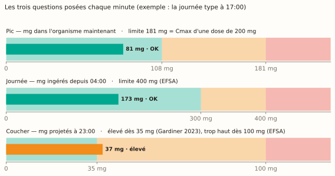
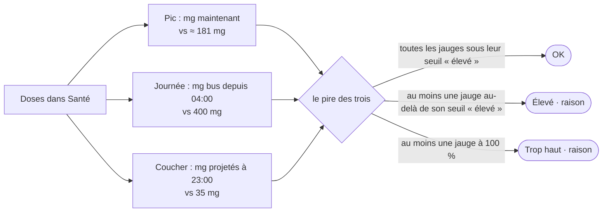
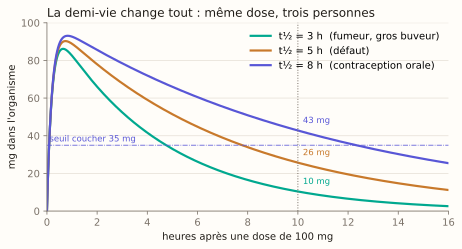
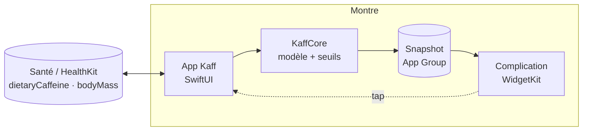
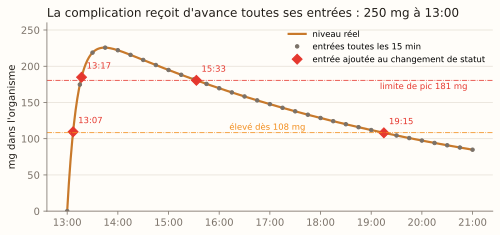

# Kaff

**Combien de caféine il te reste dans le corps, là, maintenant.** Kaff est une app Apple Watch autonome
(watchOS 26) : tu enregistres ce que tu bois sur la montre, elle estime en continu la caféine présente dans ton
organisme, te dit si c'est OK, élevé ou trop haut, à quelle heure tu pourras dormir tranquille, et affiche tout
ça en complication sur le cadran.

<p align="center">
  
  
  
  
</p>

> Estimation indicative, pas un avis médical. Aucun capteur ne mesure la caféine : Kaff calcule à partir de ce que
> tu déclares avoir bu. Usage adulte.

## En trente secondes

- **Tu enregistres** une boisson du catalogue (espresso, thé, cola…) ou une quantité en mg, en deux taps et un tour
  de couronne. La dose part dans Santé (HealthKit), qui reste la source de vérité.
- **Kaff calcule chaque minute** ce qu'il en reste dans ton organisme, avec un modèle pharmacocinétique classique
  et une demi-vie que tu peux régler.
- **Trois questions** décident du statut : le niveau du moment, le total de la journée, et ce qu'il restera au
  coucher. La complication reçoit d'avance toute la courbe et décroît sans ouvrir l'app.

## Comment ça marche

### 1. Une dose suit toujours la même courbe

Une fois bue, la caféine passe dans le sang en une quarantaine de minutes, puis l'organisme l'élimine de moitié
toutes les cinq heures environ. Kaff modélise ça avec la courbe de Bateman (un compartiment, absorption et
élimination de premier ordre), le modèle standard de la littérature pour la caféine.

<p align="center">
  
</p>

Pour une dose `D` prise à `t = 0` :

```
A(t) = D · ka / (ka − ke) · (e^(−ke·t) − e^(−ka·t))
ka = 5 h⁻¹        ke = ln 2 / t½        t½ = 5 h par défaut, réglable de 2 à 10 h
```

### 2. Les boissons s'additionnent

Chaque prise a sa propre courbe ; ce que tu as dans le corps, c'est la somme. Kaff relit toutes les doses de
Santé et les superpose. Voici une journée : deux espressos le matin, un thé vert l'après-midi.

<p align="center">
  
</p>

Le bandeau du haut est ce que la montre affiche. Dès le thé de 15:30, le statut passe à « élevé · coucher » :
non pas parce que le niveau est haut maintenant, mais parce qu'il en restera 28 mg à 23:00. Et Kaff indique
l'heure à partir de laquelle le niveau sera passé sous le seuil : « OK pour dormir à 21:19 ».

### 3. Trois questions, chaque minute

<p align="center">
  
</p>

| Question | Ce qui est comparé | Limite par défaut | « élevé » dès |
|---|---|---|---|
| **Pic** : est-ce beaucoup, là maintenant ? | mg dans l'organisme | ce qu'atteint une dose unique de 3 mg/kg (plafond 200 mg), soit ≈ 181 mg | 60 % |
| **Journée** : ai-je trop bu aujourd'hui ? | mg ingérés depuis 04:00 | 400 mg | 75 % |
| **Coucher** : vais-je bien dormir ? | mg qu'il restera à l'heure du coucher | 35 mg | 60 % |

Le statut global est le pire des trois, et la raison est affichée. Les limites journalière et coucher, le poids, la
demi-vie et l'heure du coucher se règlent à la couronne.



### 4. Ta demi-vie change tout

Cinq heures est une moyenne. Un fumeur ou un gros buveur de café élimine plus vite, une contraception orale
ralentit l'élimination, et la génétique fait le reste. C'est le réglage le plus important de l'app.

<p align="center">
  
</p>

### 5. Où vont les données



Les doses et le poids vivent dans Santé, sauvegardés avec ton iPhone et réutilisables par n'importe quelle autre
app. Kaff écrit un instantané léger (doses récentes, seuils déjà calculés, jamais le poids) dans l'App Group ;
la complication ne lit que ça et ne touche jamais HealthKit. Kaff n'envoie rien nulle part : pas de réseau, pas de statistiques.

### 5 bis. Et le sommeil ? (v0.2)

Aucun capteur ne mesure la caféine, mais la montre sait quand tu te couches. Si tu actives « Coucher depuis
Santé » dans Réglages, Kaff lit tes nuits des 14 derniers jours (lecture seule, jamais affichées) et prend la
médiane de tes heures de coucher, siestes exclues, à partir de trois nuits. C'est cette heure qui sert à la
question « coucher » et à la complication ; sinon c'est l'heure que tu as réglée à la main.

Deux notifications, chacune à activer séparément : **« OK pour dormir »** quand le niveau repasse sous le seuil
coucher (jamais après 04:00), et **« Dernière prise avant le coucher »**, calculée pour ta boisson favorite :
le dernier instant où la prendre laisse encore le niveau sous le seuil à l'heure du coucher. Un espresso
(63 mg) avec un seuil de 35 mg et une demi-vie de 5 h, c'est environ 4 h 30 avant.

### 6. La complication sait déjà tout

Puisque la courbe est déterministe, Kaff calcule d'avance la timeline de la complication : une entrée tous les
quarts d'heure, plus une entrée exactement à chaque changement de statut. Le cadran se met à jour tout seul,
même l'app fermée. Si l'app n'a pas été ouverte depuis plus longtemps que la fenêtre de doses transmise
(30 h au moins), la complication affiche « Ouvrir Kaff » : elle ne peut plus garantir qu'aucune dose ne lui
manque.

<p align="center">
  
</p>

## La science derrière

Chaque constante de Kaff a été confrontée à la littérature (avis EFSA 2015, IOM 2001, méta-analyse Gardiner 2023,
articles originaux, USDA), avec extraits cités et DOI. Résultat : l'approche est la bonne, deux valeurs ont été
corrigées (le seuil coucher, dérivé de Gardiner 2023 ; la limite de pic, qui est la concentration maximale d'une
dose unique, pas la dose elle-même) et quelques attributions rectifiées.

<p align="center">
  
</p>

→ **[docs/science/](docs/science/README.md)** : la synthèse, les deux revues complètes et les décisions.

## Installer

Prérequis : Xcode 26.6 avec le SDK watchOS 26, [XcodeGen](https://github.com/yonaskolb/XcodeGen)
(`brew install xcodegen`), et un compte développeur Apple pour une montre physique.

```bash
cp Config/Local.xcconfig.example Config/Local.xcconfig   # puis renseigner DEVELOPMENT_TEAM (Team ID)
make run                                                 # génère le projet, build, installe et lance sur le simulateur
```

| Cible | Effet |
|---|---|
| `make generate` | `xcodegen generate` (crée `Config/Local.xcconfig` depuis l'exemple si absent) |
| `make build` / `make run` | Build Debug, puis installation et lancement sur le simulateur |
| `make test` | Tests de l'app (`KaffTests`) sur le simulateur, avec couverture |
| `make test-core` | `swift test` du package `KaffCore` |
| `make figures` | Regénère les figures de ce README (matplotlib) |
| `make clean` | Supprime `build/`, le `.xcodeproj` et `.build` du package |

Variables : `SIM` (défaut `Apple Watch Series 11 (46mm)`), `OS` (défaut `26.5`), ou `SIM_ID` pour un UDID précis.
Montre physique : `xcodegen generate && open Kaff.xcodeproj`, choisir la montre comme destination, Run.

## Sous le capot

```
Kaff/
├── Packages/KaffCore/       # logique pure et testée : modèle PK, seuils, timeline, catalogue
├── KaffUI/                  # thème, anneau, formats — compilés dans l'app et dans l'extension
├── Kaff Watch App/          # SwiftUI : écrans, AppModel @Observable, services HealthKit et cache
├── KaffComplication/        # extension WidgetKit, quatre familles accessory, deep link kaff://home
├── KaffTests/               # tests de l'app avec stores simulés
├── docs/                    # science, figures, roadmap, spec, direction UI, captures
├── project.yml              # XcodeGen — le .xcodeproj n'est jamais édité à la main
└── Makefile
```

Swift 6 strict concurrency, Swift Testing, Swift Charts, Liquid Glass, couronne digitale et haptiques partout où
ça a du sens. Toute la logique vit dans `KaffCore`, testée sous macOS en quelques secondes ; les vues restent fines.

## Suivi

- [Roadmap et journal](docs/ROADMAP.md) : jalons M0→M6, décisions, blocages.
- [Plan d'implémentation](docs/superpowers/plans/2026-08-27-kaff-implementation.md) et
  [spécification](docs/superpowers/specs/2026-08-27-kaff-design.md).
- [Direction UI/UX](docs/design/ui-direction.md), [instructions de travail](CLAUDE.md).

## Limites connues

- Les doses ajoutées depuis l'iPhone ou une autre app sont prises en compte à la prochaine ouverture de Kaff.
- Les notifications sont replanifiées à chaque ouverture de l'app : sans l'ouvrir de la journée, le plan de la
  veille n'est pas recalculé.
- Le sommeil lu sur la montre est celui qu'elle a suivi elle-même (ou synchronisé récemment) : un sommeil saisi
  seulement sur l'iPhone ou par une app tierce peut manquer.
- Le contenu réel d'une tasse varie du simple au sextuple selon le café ; au-delà de ~500 mg en une prise le
  modèle sous-estime le résidu ; grossesse et certains médicaments sortent des bornes de demi-vie.
  Détail dans [docs/science/](docs/science/README.md#ce-que-kaff-ne-sait-pas-faire-et-le-dit).

## Licence

À définir.
