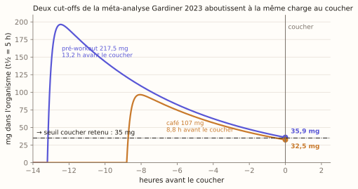

# La science derrière Kaff

Kaff estime la caféine présente dans l'organisme. Avant de finaliser la v0.1, une question simple a été posée :
**quelle est la meilleure façon d'estimer cette quantité avec ce qu'une Apple Watch et Santé peuvent fournir,
et l'app fait-elle vraiment ça ?** Cette page présente la réponse, les documents complets et ce qui a changé.

> Estimation indicative. Kaff n'est pas un dispositif médical et ne remplace pas un avis médical.

## La réponse courte

**Rien, sur une montre, ne mesure la caféine.** Ni la fréquence cardiaque, ni la variabilité cardiaque, ni la
température ou le SpO2 ne sont des marqueurs exploitables : les études sont contradictoires, les effets faibles
et non monotones, brouillés par l'activité, le sommeil et l'habituation. La seule mesure directe portable est un
patch de sueur de laboratoire.

La meilleure estimation disponible est donc **un modèle pharmacocinétique nourri par ce que vous déclarez avoir
bu**, avec le poids corporel pour ajuster les seuils. C'est ce que fait Kaff, et chaque brique de ce choix a été
confrontée à la littérature :

| Ce que fait Kaff | Ce que dit la littérature | Verdict |
|---|---|---|
| Modèle à un compartiment, absorption et élimination de premier ordre (courbe de Bateman) | Meilleur ajustement en pharmacocinétique de population (Seng 2009, Kamimori 2002) | ✅ conforme |
| La dose bue = la dose absorbée | Biodisponibilité orale ≈ 100 % (Blanchard & Sawers 1983) | ✅ conforme |
| Les prises s'additionnent linéairement | Vrai jusqu'à ~10 mg/kg ; au-delà de ~500 mg en une prise l'élimination sature (Kaplan 1997, Denaro 1990) | ✅ conforme, limite documentée |
| Pic ≈ 44 min après la prise (ka = 5 h⁻¹) | tmax 30–120 min (EFSA 2015), ≈ 42 min pour le café (Liguori 1997) | ✅ conforme |
| Demi-vie 5 h par défaut, réglable 2–10 h | 5 h, 1,5–9,5 h (IOM 2001) ; 4 h, 2–8 h (EFSA 2015). Tabac ↓, contraception orale ↑ | ✅ conforme ; grossesse et fluvoxamine hors bornes |
| Affiche des mg dans l'organisme, le poids sert aux seuils | A(t) ne dépend pas du volume de distribution ; les seuils EFSA sont en mg/kg | ✅ conforme |
| Dose unique 3 mg/kg plafonnée à 200 mg | EFSA 2015 : 200 mg ≈ 3 mg/kg | ✅ valeur conforme, **objet comparé corrigé** |
| 400 mg par jour | EFSA 2015 (« consommés au cours de la journée »), FDA | ✅ conforme |
| Charge corporelle projetée au coucher | Approche validée par Gardiner 2023 et Drake 2013 | ✅ approche conforme, **valeur corrigée** |

## Ce que la revue a changé dans l'app

  

1. **Seuil coucher : 50 → 35 mg.** La méta-analyse Gardiner 2023 (24 études) donne deux cut-offs empiriques pour
   ne pas perdre de sommeil : un café de 107 mg au moins 8,8 h avant le coucher, un pré-workout de 217,5 mg au
   moins 13,2 h avant. Projetés avec le modèle de Kaff, ces deux scénarios très différents aboutissent à la même
   charge au coucher, 32,5 et 35,9 mg (figure ci-dessus). La valeur retenue est 35 mg. Contrôles : 100 mg près du
   coucher perturbe le sommeil (EFSA 2015) ; 400 mg six heures avant le coucher retire plus d'une heure de sommeil
   (Drake 2013).
2. **Limite de pic : la Cmax d'une dose unique, pas la dose elle-même.** La limite EFSA de 200 mg est une quantité
   *ingérée*. Kaff compare, lui, la *charge corporelle* du moment. L'EFSA (§5.1.3) tranche : des prises répétées ne
   doivent pas dépasser la concentration maximale qu'atteint une dose unique de 200 mg. Cette concentration
   maximale vaut, dans le modèle, 90 % de la dose (180,6 mg à t½ 5 h). L'anneau, la courbe et le statut se
   rapportent désormais à cette valeur ; les Réglages continuent d'afficher « dose unique max 200 mg ».
3. **Catalogue.** Chocolat noir 70–85 % : 24 mg pour 30 g (USDA, l'ancienne valeur était celle du 45–59 %).
   Maté : 80 mg pour 150 ml (Heck & de Mejia 2007) ; la source « EFSA » citée n'existait pas.
4. **Attributions.** « tmax 30–60 min » devient 30–120 min (EFSA) ; « demi-vie 5 h, 1,5–9,5 h » est attribuée à
   l'IOM 2001, l'EFSA disant 4 h (2–8 h) ; volume de distribution 0,67 L/kg.

Commits : `d817495` (attributions, coucher 35 mg), `54762e5` (limite de pic, snapshot v3), `7558a78` (UI),
`f2f8f81` (catalogue), `bc1117b` et suivants (documentation). Les tests qui encodent ces résultats sont dans
`Packages/KaffCore/Tests/KaffCoreTests/` : `PharmacokineticScienceTests.swift` (fenêtre de tmax et fraction au pic
sur toute la plage de demi-vies, bilan de masse) et `LevelAssessorTests.swift` (scénarios Gardiner et Drake,
dose à 95 % et 105 % de la limite).

## Méthode

- **Deux revues indépendantes**, l'une sur le modèle pharmacocinétique, l'autre sur les seuils, le catalogue et les
  types HealthKit, menées le 4 septembre 2026, puis réconciliées. Elles concordent sur tous les chiffres.
- **Sources primaires ou de référence** uniquement : l'avis EFSA 2015 (texte intégral), les articles originaux
  (Blanchard & Sawers 1983, Kaplan 1997, Drake 2013, Gardiner 2023, etc.), l'IOM 2001, USDA FoodData Central
  (via son API), la documentation développeur Apple. Chaque affirmation est accompagnée d'un **extrait cité tel
  que lu** et d'un DOI ou d'une URL.
- **Ce qui n'a pas pu être vérifié est dit** : la version finale de l'avis EFSA chez Wiley refusait l'accès
  (copie DTU Orbit et projet de consultation publique utilisés, concordants) ; quelques articles n'ont été lus
  qu'en résumé (Clark & Landolt 2017, Nehlig 2018, Koenig 2013) ; Fredholm 1999 et Landolt 1995 non consultés.

## Les documents

| Document | Contenu |
|---|---|
| [`2026-09-04-fact-check.md`](2026-09-04-fact-check.md) | **Synthèse et décisions** : verdict de fond, écarts trouvés, changements appliqués, limites, backlog sourcé |
| [`fact-check-pk.md`](fact-check-pk.md) | Revue du modèle pharmacocinétique : type de modèle, linéarité, biodisponibilité, tmax et ka, demi-vie et ses facteurs de variation, volume de distribution, capteurs de montre. 38 références |
| [`fact-check-seuils.md`](fact-check-seuils.md) | Revue des seuils (EFSA, FDA, sommeil), de la journée caféine, du catalogue boisson par boisson (USDA, EFSA, variabilité réelle) et des types HealthKit. 21 références |
| [`../figures/make_figures.py`](../figures/make_figures.py) | Script qui génère toutes les figures du README à partir des constantes du modèle (`make figures`) |

## Ce que Kaff ne sait pas faire (et le dit)

- Au-delà de ~500 mg en une prise, ou en cas de très forte consommation chronique, l'élimination ralentit : le
  résidu réel est **plus élevé** que l'estimation. Augmenter la demi-vie dans Réglages compense en partie.
- La vitesse d'absorption est celle d'une boisson chaude. Gélules, sodas et chocolat montent plus lentement.
- Grossesse avancée (demi-vie 11–18 h), fluvoxamine (31 h), nourrissons : hors des bornes de réglage. Usage
  adulte uniquement.
- Le contenu réel d'une tasse varie du simple au sextuple selon l'établissement (espresso 48–322 mg, Crozier 2012
  et Ludwig 2014). Saisir les mg directement, ou créer une boisson personnalisée, reste le seul remède.
- Un profil enregistré avant cette révision conserve ses anciens réglages (coucher 50 mg).

## Pistes ouvertes par la revue

Heure de coucher réelle lue dans `sleepAnalysis` ; fraîcheur du poids ; mode grossesse ou allaitement (limite
200 mg/j, demi-vie allongée, EFSA 2015) ; indices de demi-vie dans Réglages (tabac, contraception) ; vitesse
d'absorption par type de boisson. Détail et sources dans la synthèse, §5, et dans [`../ROADMAP.md`](../ROADMAP.md).
